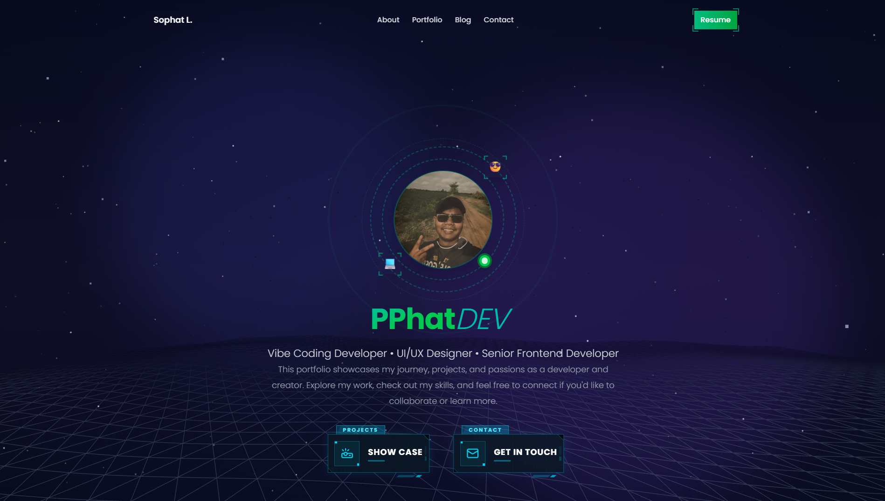

# PPhat Portfolio Website

A modern, interactive portfolio website showcasing design and development work with stunning 3D animations, particle systems, and smooth interactions. Built with Next.js and featuring WebGL-powered visuals.

🌐 **Live Demo:** [https://portfolio-web-gl-pphat.vercel.app/](https://portfolio-web-gl-pphat.vercel.app/)



## ✨ Features

### Core Sections
- **Hero** - Dynamic landing section with animated particle systems
- **About** - Introduction and professional background
- **Experience** - Work history and professional journey
- **Tech Stack** - Interactive display of technologies and skills
- **Portfolio** - Project showcase with detailed descriptions
- **Blog** - Insights, tutorials, and design articles
- **Contact** - Get in touch form with smooth animations

### Visual Effects
- **3D Graphics** - Interactive Three.js scenes and WebGL visualizations
- **Particle Systems** - Advanced and instanced particle animations
- **Cosmic/Atomic Backgrounds** - Dynamic animated backgrounds
- **Smooth Scrolling** - Section-based scroll animations with hash routing
- **Theme Switching** - Dark/light mode with persistent preferences
- **Section Reveals** - Smooth reveal animations on scroll

### Technical Features
- Server-side rendering with Next.js App Router
- TypeScript for type safety
- Responsive design with Tailwind CSS
- Framer Motion animations
- Anime.js integration
- React Three Fiber for 3D graphics
- Lucide React icons
- ESLint configuration

## 🚀 Tech Stack

### Frontend Framework
- **Next.js 16** - React framework with App Router
- **React 19** - UI library
- **TypeScript** - Type-safe development

### Styling & UI
- **Tailwind CSS** - Utility-first CSS framework
- **Class Variance Authority** - Component variants
- **clsx & tailwind-merge** - Conditional styling utilities

### Animations & 3D
- **Three.js** - 3D graphics library
- **React Three Fiber** - React renderer for Three.js
- **React Three Drei** - Useful helpers for React Three Fiber
- **Framer Motion** - Animation library
- **Anime.js** - JavaScript animation engine

### Icons & Theming
- **Lucide React** - Icon library
- **React Icons** - Additional icon sets
- **next-themes** - Theme management

## 📦 Getting Started

### Prerequisites
- Node.js 20 or higher
- npm, yarn, pnpm, or bun

### Installation

1. Clone the repository
```bash
git clone <repository-url>
cd PPhatWebsite
```

2. Install dependencies
```bash
npm install
# or
yarn install
# or
pnpm install
```

3. Run the development server
```bash
npm run dev
# or
yarn dev
# or
pnpm dev
# or
bun dev
```

4. Open [http://localhost:3000](http://localhost:3000) in your browser

### Build for Production

```bash
npm run build
npm run start
```

## 📁 Project Structure

```
src/
├── app/                      # Next.js App Router pages
│   ├── page.tsx             # Home page
│   ├── layout.tsx           # Root layout
│   ├── globals.css          # Global styles
│   ├── blog/                # Blog section
│   └── webgl-practice/      # WebGL experiments
├── components/
│   ├── animation/           # 3D and particle components
│   │   ├── AdvancedParticleSystem.tsx
│   │   ├── InstancedParticleSystem.tsx
│   │   ├── ParticleScene.tsx
│   │   └── ThreeScene.tsx
│   ├── common/              # Reusable UI components
│   │   ├── Button.tsx
│   │   ├── Input.tsx
│   │   ├── Textarea.tsx
│   │   ├── ThemeToggle.tsx
│   │   ├── SectionReveal.tsx
│   │   └── *Icon.tsx        # Technology icons
│   ├── home/                # Home page sections
│   │   ├── Hero.tsx
│   │   ├── About.tsx
│   │   ├── Experience.tsx
│   │   ├── TechStack.tsx
│   │   ├── Portfolio.tsx
│   │   ├── Blog.tsx
│   │   └── Contact.tsx
│   ├── layout/              # Layout components
│   │   ├── Header.tsx
│   │   ├── Footer.tsx
│   │   ├── AtomicBackground.tsx
│   │   └── CosmicBackground.tsx
│   └── providers/
│       └── ScrollHashProvider.tsx
├── hooks/
│   └── useScrollHash.ts     # Scroll-based hash routing
├── providers/
│   └── ThemeProvider.tsx    # Theme context
└── types/
    └── css.d.ts             # CSS module types
```

## 🎨 Design Inspiration

- **Anime.js** style animations - Smooth, dynamic UI animations
- **Three.js** powered 3D graphics - Interactive 3D visualizations
- **Parallax scrolling** - Depth and immersion effects

## 🛠️ Development

### Available Scripts

- `npm run dev` - Start development server
- `npm run build` - Build for production
- `npm run start` - Start production server
- `npm run lint` - Run ESLint

### Code Quality

This project uses:
- **ESLint** - Code linting with Next.js configuration
- **TypeScript** - Static type checking
- **Strict mode** - Enhanced type safety

## 🌐 Deployment

### Deploy on Vercel

The easiest way to deploy this Next.js app is to use the [Vercel Platform](https://vercel.com/new):

1. Push your code to GitHub
2. Import your repository to Vercel
3. Vercel will detect Next.js and configure automatically
4. Deploy!

Check out the [Next.js deployment documentation](https://nextjs.org/docs/app/building-your-application/deploying) for more options.

### Other Platforms

This app can also be deployed to:
- **Netlify** - With Next.js plugin
- **AWS Amplify** - Full-stack deployment
- **Railway** - Container-based deployment
- **DigitalOcean App Platform** - Managed deployment

## 📄 License

This project is private and proprietary.

## 🤝 Contributing

This is a personal portfolio project. If you have suggestions or find bugs, feel free to open an issue.

---

Built with ❤️ using Next.js, Three.js, and modern web technologies.
